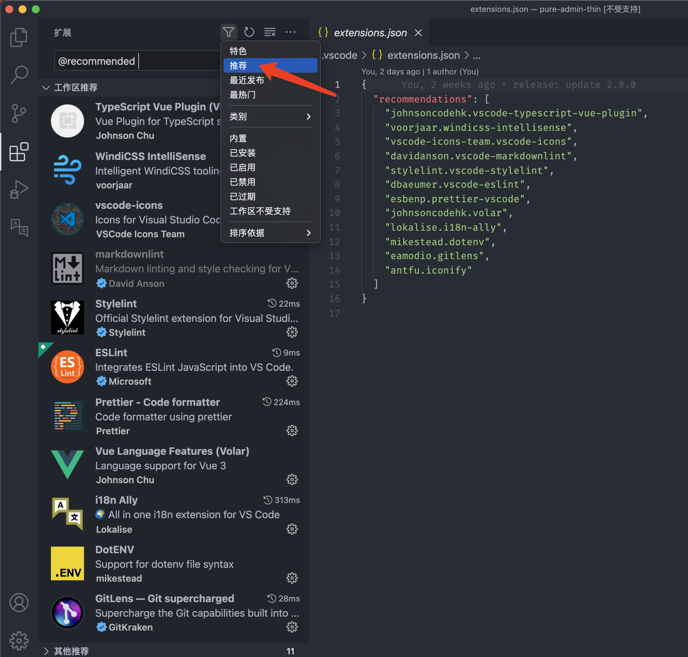
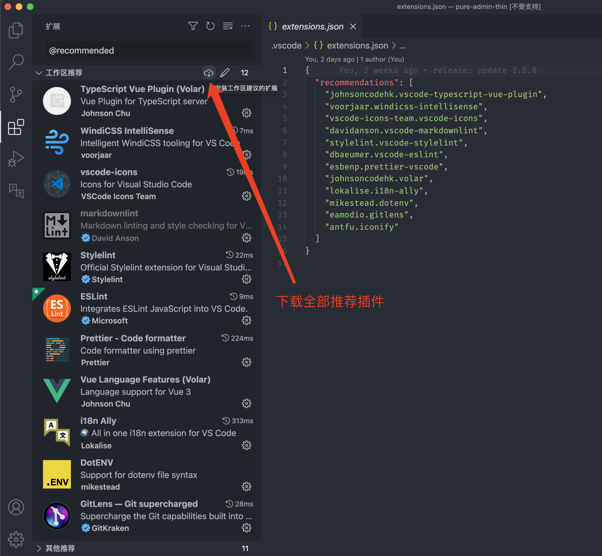

# DEV-template1.1

这个模板帮助在Vite中使用Vue3进行开发。

> 技术一览

- Vite5
- Vue3+TS
- vue-router4路由管理
- pinia全局状态管理
- eslint+prettier自动格式化
- vitest单元测试

## 编译器 vscode

### 一键安装推荐的 vscode 插件




### vue3.code-snippets

在 `.vue` 文件输入 `vue` 即可看到联想选项，选择 `Vue3.x` 即可生成

## 项目 Setup

```sh
npm install
```

### 编译和热重载本地开发

```sh
npm run dev
```

### 生产环境

```sh
npm run build
```

### 运行单元测试 [Vitest](https://vitest.dev/)

```sh
npm run test:unit
```

### ESLint检查 [ESLint](https://eslint.org/)

```sh
npm run lint
```
